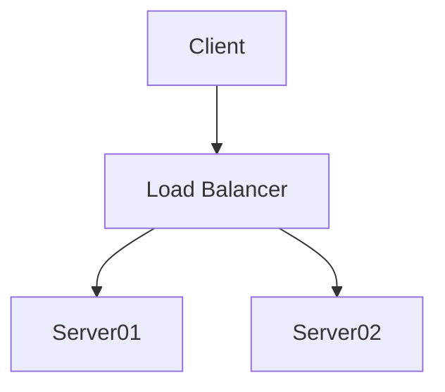
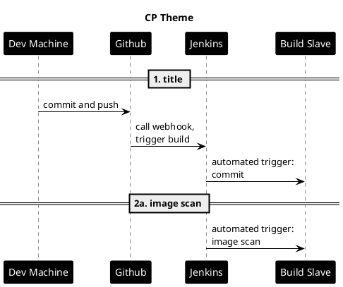

# Diagrams as Code

## Mermaid



## Plant UML



## C4 Container Diagram

See [Mermaid's C4 Syntax](https://mermaid.js.org/syntax/c4c.html) and
[C4 Plant UML](https://github.com/plantuml-stdlib/C4-PlantUML/blob/master/README.md).

```puml
@startuml C4_Elements
!include https://raw.githubusercontent.com/plantuml-stdlib/C4-PlantUML/master/C4_Container.puml

Person(personAlias, "Label", "Optional Description")
Container(containerAlias, "Label", "Technology", "Optional Description")
System(systemAlias, "Label", "Optional Description")

Rel(personAlias, containerAlias, "Label", "Optional Technology")
@enduml
```
