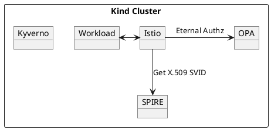

# Istio

| Name     | Description                                                                        |
|----------|------------------------------------------------------------------------------------|
| Workload | Uses the Istio sidecar for network communication                                   |
| Istio    | Proxies network requests and checks with OPA whether the request should be allowed |
| OPA      | Provides AuthZ decisions to Istio                                                  |
| SPIRE    | Mints X.509 SVIDs for Istio                                                        |
| Kyverno  | Injects Istio and OPA sidecars into workload pods                                  |
