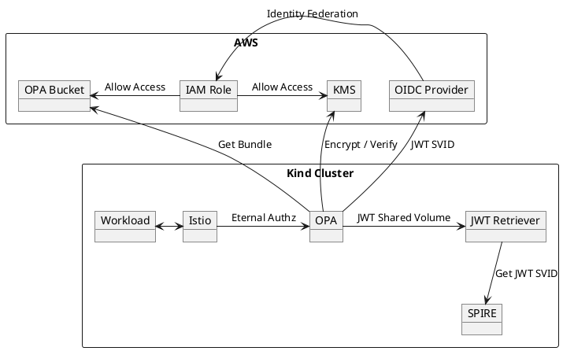

# OPA Istio KMS



| Name     | Description                                                                                           |
|----------|-------------------------------------------------------------------------------------------------------|
| Workload | Uses the Istio sidecar for network communication                                                      |
| Istio | Proxies network requests and checks with OPA whether the request should be allowed                    |
| OPA | Provides AuthZ decisions to Istio, retrieves Bundles from S3 and uses KMS to verify Bundle signatures |
| JWT Retriever | Retrieves the JWT SVID from SPIRE regularly and makes this available to OPA through a shared volume   |
| SPIRE    | Mints JWT SVIDs for OPA                                                                               |
| OPA Bucket | Holds the OPA Bundles                                                                                 |
| KMS | Holds the keys for signing and verifying Bundles                                                      |
| IAM Role | Grants OPA access to the S3 Bucket and the Verify operation on the KMS Keys                           |
| OIDC Provider | Verifies the provided JWT SVID and returns temporary credentials based on the identity mapping to IAM Role                                                                                                      |

## OPA Bundle Signing

What do the [docs](https://www.openpolicyagent.org/docs/latest/management-bundles/#signing) have to say about this?

We can verify this for ourselves by generating a key, signing a bundle and using a little jq-foo on the signature.

```shell
openssl genpkey -algorithm RSA -out private_key.pem -pkeyopt rsa_keygen_bits:2048
mkdir example
cat <<EOF > example/example.rego
package opa.example

default allow = false
EOF
opa sign --signing-key private_key.pem --bundle example
```

To view the claims run the following:

```shell
cat .signatures.json | jq -r '.signatures[0] | split(".") | .[1] | @base64d | fromjson'
```

We'll get something like this:

```json
{
  "files": [
    {
      "name": "example/example.rego",
      "hash": "92265e74341ca343e9b76a337c4d35f990c8cc5dd51ff575689d6bde2ed20d13",
      "algorithm": "SHA-256"
    }
  ]
}
```

To view the header run the following:

```shell
cat .signatures.json | jq -r '.signatures[0] | split(".") | .[0] | @base64d | fromjson'
```

We'll get something like this:

```json
{
  "alg": "RS256"
}
```

Let's tidy that up

```shell
rm -rf example/ .signatures.json private_key.pem
```

## Custom Bundle Signing

Where do we even start with that? Luckily, there's an 
[example](https://github.com/open-policy-agent/contrib/tree/main/custom_bundle_signing).

Not so fast, we want this to work with Istio, so we also need to include the 
[OPA-Envoy](https://www.openpolicyagent.org/docs/latest/envoy-introduction/) Plugin, that
[extends](https://github.com/open-policy-agent/opa-envoy-plugin/blob/main/cmd/opa-envoy-plugin/main.go) OPA with a gRPC
server that implements the Envoy External Authorization API.

Putting that together with a bit of KMS, we end up with

* [main.go](cmd/opa/main.go)
* [setup.go](setup/setup.go)
* [signer.go](internal/signer.go)
* [verifier.go](internal/verifier.go)
* [kms.go](internal/kms.go)
* [bundle.go](internal/bundle.go)
