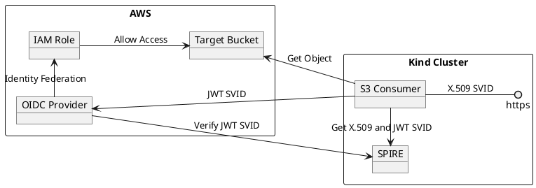

# S3 Consumer

| Name          | Description                                                                                                                    |
|---------------|--------------------------------------------------------------------------------------------------------------------------------|
| S3 Consumer   | Accesses the target bucket by exchanging a JWT SVID for temporary AWS Credentials, exposes an https interface using X.509 SVID |
| SPIRE         | Mints X.509 and JWT SVIDs for the S3 Consumer                                                                                  |
| OIDC Provider | Verifies the provided JWT SVID and returns temporary credentials based on the identity mapping to IAM Role                     |
| IAM Role      | Provides read access to the target bucket                                                                                      |
| Target Bucket | Holds the object(s) the S3 Consumer wants to access                                                                            |
