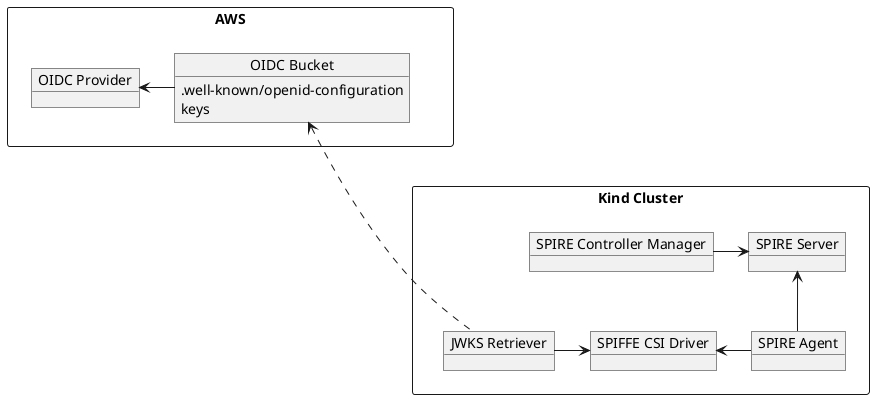

# SPIRE

## Components

| Name                     | Description                                                                                                         |
|--------------------------|---------------------------------------------------------------------------------------------------------------------|
| SPIRE Server             | Vends Identity Documents in the form of X.509 and JWT SVIDs                                                         |
| SPIRE Controller Manager | Automatically registers K8s workloads with SPIFFE IDs                                                               |
| SPIRE Agent              | Determines the Identity of the calling Workload in order to issue correct SVIDs                                     |
| SPIFFE CSI Driver        | CSI Implementation that allows Workloads to access the Workload API **without** the need to mount Host Path Volumes |
| JWKS Retriever           | Retrieves the JWKS for JWT SVIDs for the SPIRE Trust Domain                                                         |
| OIDC Bucket              | Provides a publicly accessible OIDC Endpoint for the OIDC Provider                                                  |
| OIDC Provider            | Establishes trust between the SPIRE Trust Domain and the AWS Account                                                |

SPIRE periodically rotates the JWKS. If you run the cluster for an extended period of time, you will need to update the 
JWKS to ensure the examples continue to work.
